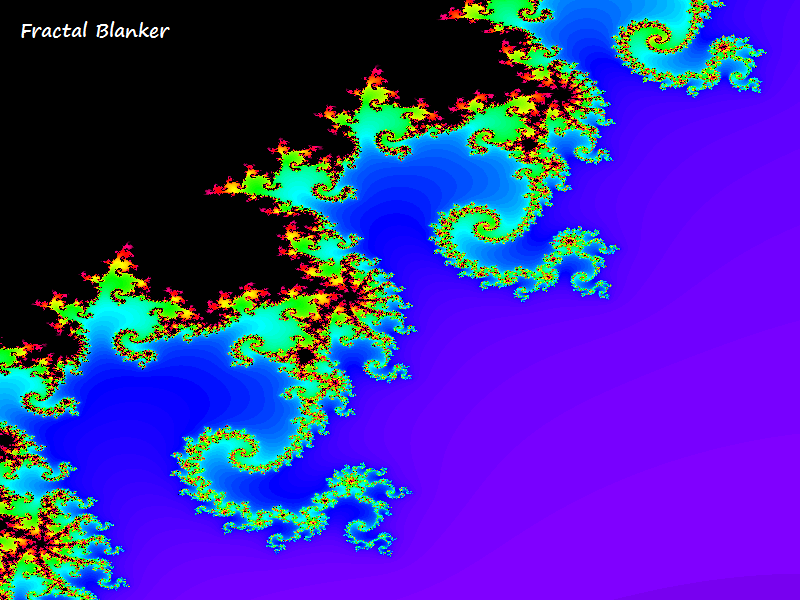
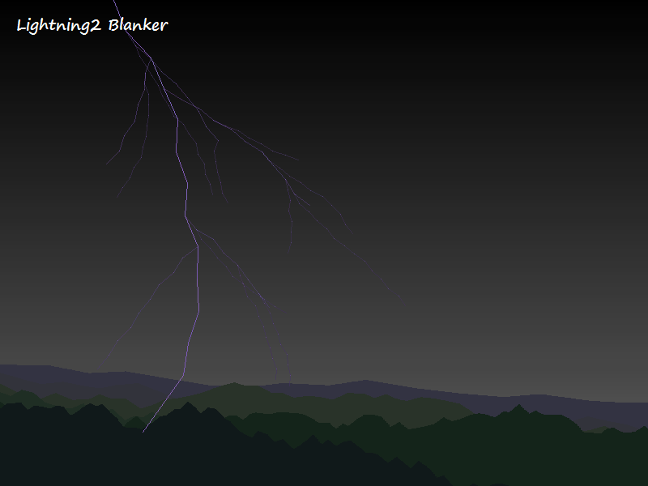
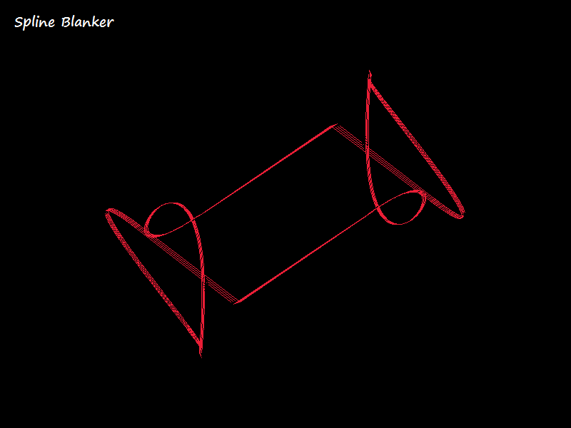

# Some simple Screen blankers written in QB64
Most of the screen blanker modules in this small collection are written by myself, others were just graphic sample programs from other QB64 Forum members, which I've altered into a blanker module. Just read the header notes in each module for credits and more information.

>**These blankers work with every QB64 version since v0.954, so if you're one of these normal people who not update to the latest build every week, that's not a problem. Just use whatever QB64 version you've installed, as long it's greater or equal to the 0.954 version. This also includes all [Phoenix Edition](https://github.com/QB64-Phoenix-Edition/QB64pe/releases) versions.**

**Blanker modules:**

- Fractal
- Lightning
- Mystify
- Spinner
- Splines
- Worms
- and several more

----------

#### Download the latest Release August/2025 right here: [ScreenBlankers.7z](https://github.com/RhoSigma-QB64/ScreenBlankers/raw/main/ScreenBlankers.7z). The archive's GPG-Signature: [ScreenBlankers.7z.sig](https://github.com/RhoSigma-QB64/ScreenBlankers/raw/main/ScreenBlankers.7z.sig) (check against [RhoSigma's GPG-Key](https://github.com/RhoSigma-QB64/GPG-Key)).

>**Move the extracted ScreenBlankers folder with its entire contents to any place of your choice. For installation instructions have a look into the [ScreenBlankers-Info.html](https://htmlpreview.github.io/?https://github.com/RhoSigma-QB64/ScreenBlankers/blob/main/ScreenBlankers/ScreenBlankers-Info.html) file.**

----------

# Screenshots of some Blanker modules

  

  

